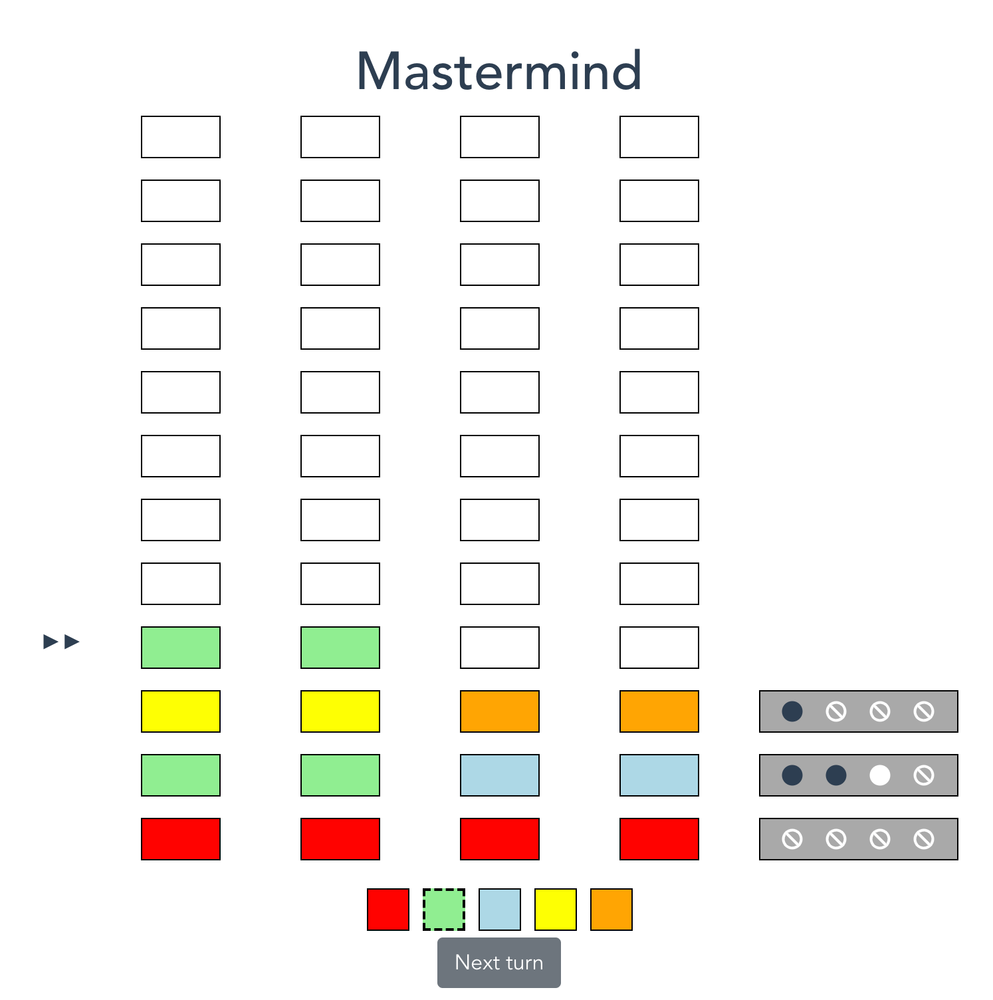

# mastermind

An implementation of MasterMind in Vue.js



## Project setup

```
yarn
```

### Compiles and hot-reloads for development
```
yarn serve
```

### Compiles and minifies for production
```
BASE_URL=/mastermind yarn build
```

### Lints and fixes files
```
yarn lint:vue
yarn lint:prettier
```

### Tests
```
yarn test
```
